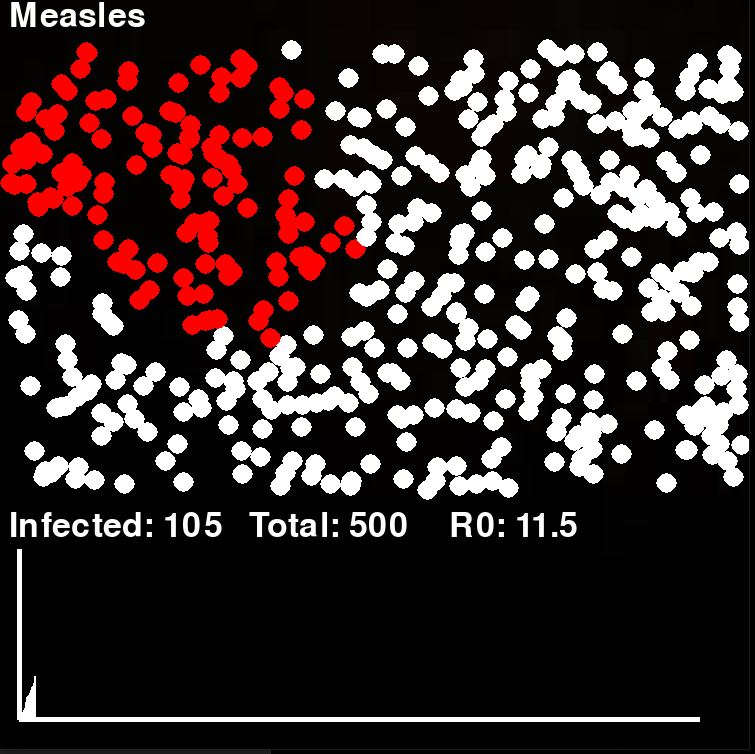
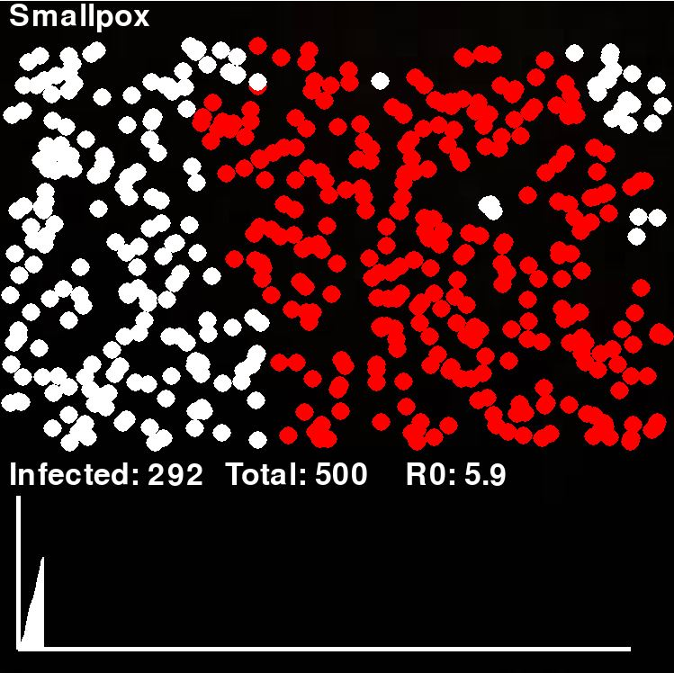

# Pydemic
Overview 
>*Epidemic simulator for visualizing the characteristic effects of various historic viruses.  
>*The simulation takes into account the R0 "R naught" for each of the outbreaks as well as other characteristics like how much the virus slows down the movement of the infected. 
>*Dots infected with the corona virus don't always slow down representing asymptomatic individuals, on the other hand a virus like Ebola slows down the dot quite a bit. 
>*Blue dots represent recovered individuals. 

Screenshots 

